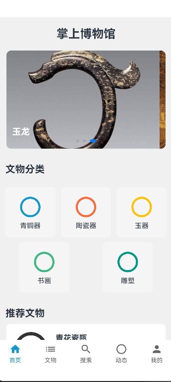
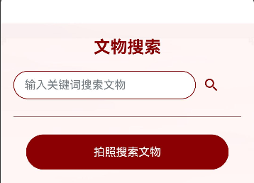
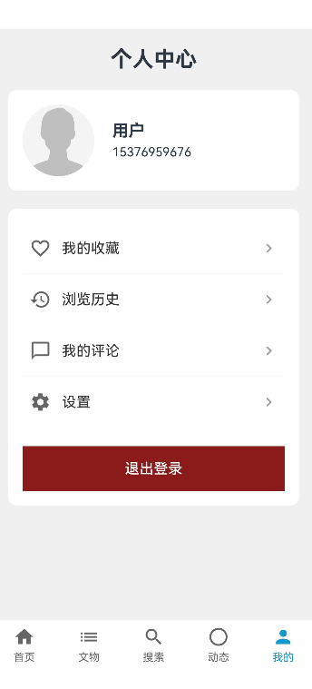
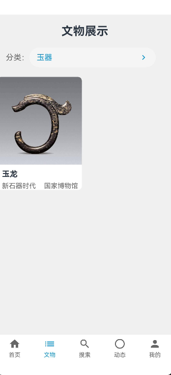
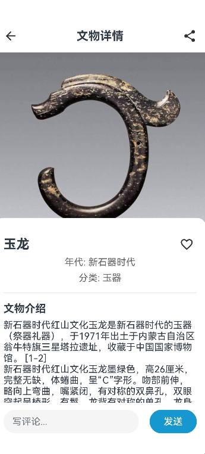
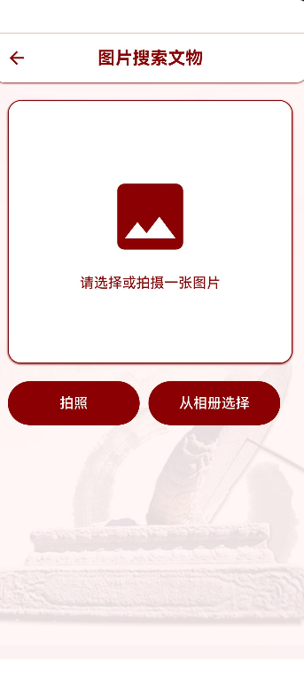
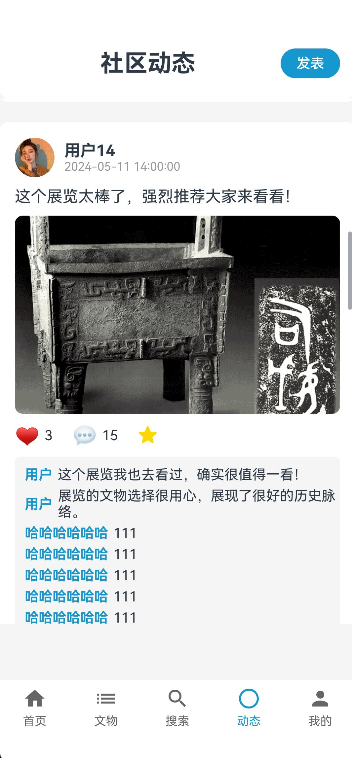
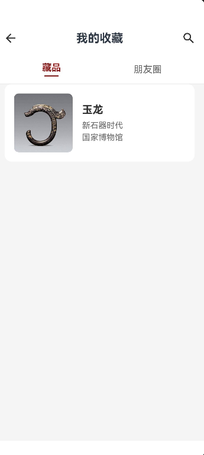
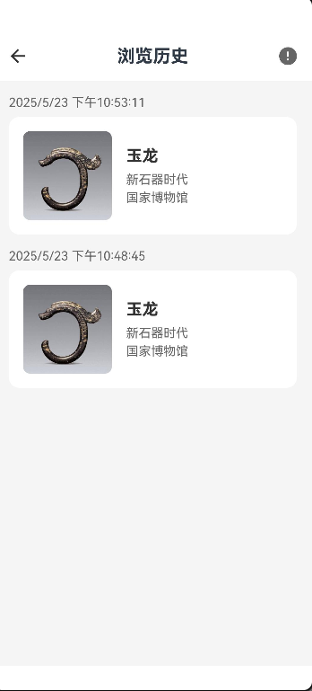

# 掌上博物馆应用用户使用手册

**掌上博物馆 HarmonyOS 应用**  
*版本 1.0.0*

## 目录

- [1. 应用介绍](#1-应用介绍)
- [2. 安装与设置](#2-安装与设置)
  - [2.1 系统要求](#21-系统要求)
  - [2.2 应用下载与安装](#22-应用下载与安装)
  - [2.3 初次设置](#23-初次设置)
- [3. 界面导航](#3-界面导航)
  - [3.1 底部导航栏](#31-底部导航栏)
  - [3.2 顶部搜索栏](#32-顶部搜索栏)
  - [3.3 侧滑菜单](#33-侧滑菜单)
- [4. 账号管理](#4-账号管理)
  - [4.1 注册账号](#41-注册账号)
  - [4.2 登录账号](#42-登录账号)
  - [4.3 个人信息管理](#43-个人信息管理)
  - [4.4 隐私设置](#44-隐私设置)
- [5. 文物浏览功能](#5-文物浏览功能)
  - [5.1 首页推荐](#51-首页推荐)
  - [5.2 文物分类浏览](#52-文物分类浏览)
  - [5.3 文物详情查看](#53-文物详情查看)
  - [5.4 3D模型展示](#54-3d模型展示)
  - [5.5 音视频讲解](#55-音视频讲解)
- [6. 搜索功能](#6-搜索功能)
  - [6.1 关键词搜索](#61-关键词搜索)
  - [6.2 以图搜图](#62-以图搜图)
  - [6.3 高级筛选](#63-高级筛选)
  - [6.4 搜索历史与收藏](#64-搜索历史与收藏)
- [7. 社区互动功能](#7-社区互动功能)
  - [7.1 发布动态](#71-发布动态)
  - [7.2 点赞与评论](#72-点赞与评论)
  - [7.3 话题分类](#73-话题分类)
  - [7.4 热门动态](#74-热门动态)
- [8. 个人中心](#8-个人中心)
  - [8.1 收藏管理](#81-收藏管理)
  - [8.2 浏览历史](#82-浏览历史)
  - [8.3 我的动态](#83-我的动态)
  - [8.4 通知消息](#84-通知消息)
- [9. 离线功能](#9-离线功能)
  - [9.1 离线浏览](#91-离线浏览)
  - [9.2 离线收藏](#92-离线收藏)
- [10. 常见问题解答](#10-常见问题解答)
- [11. 问题反馈与支持](#11-问题反馈与支持)

## 1. 应用介绍

掌上博物馆是一款专注于展示海外藏中国文物的HarmonyOS应用。本应用收录了波士顿美术馆、纳尔逊-阿特金斯艺术博物馆和明尼阿波利斯艺术博物馆的珍贵中国文物藏品，通过高清图片、详细介绍、3D模型和音视频讲解等多媒体形式，为用户提供沉浸式的文物浏览体验。

<i>图1-1: 掌上博物馆应用主要功能展示</i>

应用特色功能：

- 文物高清图片浏览与详情查看
- 文物3D模型交互式展示
- 创新的以图搜图功能
- 丰富的社区互动体验
- 个性化的文物收藏管理

## 2. 安装与设置

### 2.1 系统要求

- HarmonyOS 2.0 及以上版本
- 内存：至少2GB RAM
- 存储空间：至少200MB可用空间
- 网络连接：Wi-Fi或移动数据网络

### 2.2 应用下载与安装

**通过华为AppGallery下载安装**

1. 在设备上打开华为AppGallery（华为应用市场）
2. 在搜索栏中输入"掌上博物馆"
3. 点击应用图标，进入应用详情页
4. 点击"安装"按钮，等待安装完成

### 2.3 初次设置

首次启动应用后，将引导您完成以下设置：

1. **权限授予**：应用会请求相机权限（用于以图搜图）和存储权限（用于保存图片）。您可以根据需要选择是否授予。
2. **用户登录/注册**：您可以选择注册新账号、使用华为账号登录，或者跳过此步骤以游客模式使用应用。
3. **个性化设置**：选择您感兴趣的文物类别，应用将根据您的喜好推荐内容。
4. **数据使用设置**：选择是否允许在移动数据网络下自动下载图片和视频内容。

<i>图2-4: 应用首次启动设置引导页面</i>

## 3. 界面导航

### 3.1 底部导航栏

应用主界面底部导航栏包含五个主要功能入口：

- **首页**：浏览推荐文物和热门博物馆
- **分类**：按类别、年代、博物馆等多维度浏览文物
- **搜索**：使用关键词或图片搜索文物
- **社区**：浏览和发布用户动态，参与互动
- **我的**：查看个人收藏、浏览历史和设置

<i>图3-1: 应用底部导航栏功能示意图</i>

### 3.2 顶部搜索栏

在首页和分类页顶部，您可以找到搜索栏：

- 点击搜索图标进入搜索页面
- 点击相机图标启动以图搜图功能
- 搜索栏下方会显示热门搜索词和您的搜索历史

<i>图3-2: 应用顶部搜索栏功能展示</i>

### 3.3 侧滑菜单

从屏幕左侧边缘向右滑动，可打开侧滑菜单，包含以下选项：

- **账号信息**：显示用户头像、昵称和等级
- **通知中心**：查看系统通知和互动消息
- **离线收藏**：访问已下载的离线文物内容
- **设置**：调整应用设置和偏好
- **帮助与反馈**：获取使用帮助和提交反馈
- **关于我们**：查看应用版本和相关信息

## 4. 账号管理

### 4.1 注册账号

您可以通过以下步骤注册新账号：

1. 打开应用，点击底部导航栏的"我的"
2. 如未登录，点击"立即登录/注册"
3. 在登录页面，点击底部的"注册新账号"
4. 选择使用手机号或电子邮箱注册
5. 按照提示填写信息并验证
6. 设置密码，完成注册

<i>图4-1: 账号注册流程界面</i>

### 4.2 登录账号

您可以通过以下方式登录账号：

1. **账号密码登录**：使用注册的手机号/邮箱和密码登录
2. **验证码登录**：使用手机号接收验证码后登录
3. **华为账号登录**：点击"华为账号登录"，授权后直接登录
4. **指纹/面部识别登录**：首次登录后，可在设置中开启生物识别登录

<i>图4-2: 多种账号登录方式界面</i>

### 4.3 个人信息管理

登录后，您可以在"我的"页面管理个人信息：

1. 点击头像或昵称进入个人资料页
2. 在个人资料页，您可以：
   - 修改头像（点击头像更换）
   - 编辑昵称、个人简介
   - 设置个人标签（兴趣爱好）
   - 绑定/更换手机号或邮箱
   - 修改密码

<i>图4-3: 个人信息管理界面</i>

### 4.4 隐私设置

保护您的隐私安全，您可以调整以下设置：

1. 在"我的"页面，点击"设置"
2. 进入"隐私设置"
3. 您可以管理：
   - 谁可以看到我的动态（所有人/仅关注者/仅自己）
   - 是否允许被他人关注
   - 是否公开收藏列表
   - 是否参与推荐系统

## 5. 文物浏览功能

### 5.1 首页推荐

首页为您提供精选文物和博物馆内容：

1. **今日推荐**：每日更新的精选文物，左右滑动可查看更多
2. **热门博物馆**：展示热门博物馆及其代表性藏品
3. **最新上线**：最新加入数据库的文物展示
4. **猜你喜欢**：基于您的浏览历史和收藏推荐的文物
5. **主题专区**：根据不同主题（如青铜器、瓷器等）组织的专题内容

<i>图5-1: 首页文物推荐内容展示</i>

下拉页面可刷新内容，上拉加载更多推荐。

### 5.2 文物分类浏览

在分类页面，您可以通过多种方式浏览文物：

1. **类别分类**：按文物类型分类（如陶瓷、书法、绘画等）
2. **年代分类**：按历史朝代分类（如汉代、唐代、宋代等）
3. **博物馆分类**：按收藏博物馆分类
4. **材质分类**：按文物材质分类（如青铜、瓷器、玉石等）

<i>图5-2: 文物分类浏览界面</i>

点击任一分类，进入对应的文物列表页。在列表页中：

- 可切换网格视图和列表视图
- 可使用筛选功能进一步精确查找
- 支持按热度、时间、名称等排序

### 5.3 文物详情查看

点击任一文物缩略图，进入文物详情页：

1. **基本信息**：文物名称、年代、出土地、收藏博物馆等
2. **详细描述**：文物的历史背景、艺术特色、文化价值等
3. **高清图片**：多角度的高清图片，支持放大查看细节
4. **相关文物**：与当前文物相关的其他藏品推荐
5. **用户评论**：查看其他用户的评论和讨论

<i>图5-3: 文物详情页界面</i>

在详情页顶部，您可以：

- 点击收藏按钮将文物加入收藏
- 点击分享按钮分享文物到社交媒体或社区
- 点击下载按钮保存文物信息到本地（支持离线查看）

## 6. 搜索功能

### 6.1 关键词搜索

您可以通过关键词快速找到感兴趣的文物：

1. 点击底部导航栏的"搜索"或顶部搜索框
2. 输入关键词（如"青花瓷"、"唐三彩"等）
3. 可使用搜索筛选条件：
   - 类别筛选
   - 年代筛选
   - 博物馆筛选
   - 材质筛选

4. 搜索结果支持多种排序方式：
   - 相关度排序
   - 热度排序
   - 时间排序（按年代早晚）

### 6.2 以图搜图

创新的以图搜图功能让您通过图片寻找相似文物：

1. 在搜索页面，点击相机图标
2. 选择图片来源：
   - 拍摄新照片
   - 从相册选择
   - 截取屏幕内容

<i>图6-3: 以图搜图图片来源选择</i>

3. 调整裁剪框，选择要搜索的部分
4. 点击"搜索"按钮开始识别
5. 查看相似度排序的搜索结果

**最佳实践**：

- 确保光线充足，图像清晰
- 尽量减少背景干扰
- 选择文物上的特征部分进行搜索

### 6.3 高级筛选

搜索结果页面提供高级筛选功能：

1. 点击搜索结果页面顶部的"筛选"按钮
2. 在弹出的筛选面板中，您可以设置：
   - 文物类别（可多选）
   - 年代范围（可拖动时间轴选择）
   - 博物馆（可多选）
   - 材质（可多选）
   - 文物状态（完整/残缺）

3. 点击"应用"按钮查看筛选后的结果
4. 点击"重置"可清除所有筛选条件

## 7. 社区互动功能

### 7.1 发布动态

您可以在社区分享您的见解和发现：

1. 进入"社区"页面，点击底部的"+"按钮
2. 选择动态类型：
   - 文字动态
   - 图文动态
   - 文物分享（可关联应用内文物）

<i>图7-1: 动态类型选择界面</i>

3. 编辑动态内容：
   - 输入文字描述
   - 添加图片（最多9张）
   - 关联文物（从收藏或浏览历史中选择）
   - 添加话题标签
   - 设置位置信息

4. 设置动态可见范围（所有人/仅关注者/仅自己）
5. 点击"发布"按钮完成发布

### 7.2 点赞与评论

与其他用户互动，分享您的想法：

1. **点赞**：点击动态或评论下方的心形图标
2. **评论**：
   - 点击动态下方的评论图标
   - 在评论框输入内容
   - 可以@其他用户
   - 可以添加表情

<i>图7-3: 点赞与评论功能界面</i>

3. **回复评论**：点击特定评论进行针对性回复
4. **分享**：点击分享图标将动态分享至其他平台

## 8. 个人中心

### 8.1 收藏管理

在个人中心管理您收藏的文物：

1. 进入"我的"页面，点击"我的收藏"
2. 收藏页面分为多个分类标签：
   - 全部收藏
   - 自定义收藏夹
   - 按类别自动分组

<i>图8-1: 收藏管理界面与分类</i>

3. 长按收藏项可进行批量操作：
   - 移动至其他收藏夹
   - 下载离线收藏
   - 分享
   - 删除

4. 点击"+"创建新的自定义收藏夹
5. 点击"编辑"可管理收藏夹（重命名、删除、合并等）

### 8.2 浏览历史

查看和管理您的浏览记录：

1. 在"我的"页面，点击"浏览历史"
2. 浏览历史按时间顺序排列，可查看：
   - 今天浏览的内容
   - 昨天浏览的内容
   - 更早浏览的内容

<i>图8-3: 浏览历史时间分组展示</i>

3. 点击右上角"筛选"可按类别筛选历史记录
4. 点击"清空"可删除全部历史记录
5. 滑动单个项目可快速收藏或删除

### 8.3 我的动态

管理您发布的社区内容：

1. 在"我的"页面，点击"我的动态"
2. 查看您发布的所有动态
3. 长按动态可：
   - 编辑动态（仅限发布24小时内）
   - 置顶动态（最多3条）
   - 删除动态

### 8.4 通知消息

查看系统和用户互动通知：

1. 在"我的"页面，点击"消息通知"
2. 通知分为多个类别：
   - 评论与回复（他人对您内容的评论）
   - 点赞（他人对您内容的点赞）
   - 关注（新的关注者）
   - 系统通知（应用更新、活动等）

3. 点击"全部已读"可将所有通知标记为已读
4. 在设置中可调整通知提醒方式

## 9. 常见问题解答

**Q: 应用占用存储空间太大，如何清理？**
A: 进入"设置-存储管理"，可清理缓存、删除离线下载内容或调整图片缓存上限。

**Q: 以图搜图功能无法识别我的图片，怎么办？**
A: 确保光线充足，图像清晰无反光，尽量对准文物特征部分，避免复杂背景干扰。

**Q: 如何更改界面语言？**
A: 进入"设置-语言设置"，可选择简体中文、繁体中文或英文界面。

**Q: 3D模型加载很慢或无法显示？**
A: 请确保网络连接稳定，或尝试在Wi-Fi环境下使用。也可在设置中降低3D模型质量以提高加载速度。

**Q: 如何同步我在Web端的收藏？**
A: 确保使用相同账号登录，进入"我的-设置-数据同步"，点击"立即同步"。

**Q: 忘记密码怎么办？**
A: 在登录页面点击"忘记密码"，可通过绑定的手机号或邮箱重置密码。

## 10. 问题反馈与支持

如果您在使用过程中遇到问题或有任何建议：

1. 在应用内，进入"我的-设置-帮助与反馈"
2. 选择问题类型并填写详细描述
3. 可附加截图以说明问题
4. 提交后，我们将在3个工作日内回复

其他联系方式：

- 客服邮箱：<lokiyu_buct@163.com>
